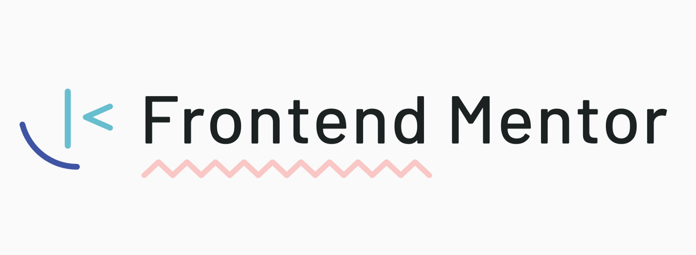

<h1 align= "center">Frontend Mentor Challenges</h1>

    
    
    <a href="https://www.frontendmentor.io/challenges">
      Frontend Mentor Challenges
    </a>
     help you improve your coding skills by building realistic projects.
    

<h2 align= "center">My solutions</h2>

## Table of Contents
- [Newbie](#newbie) 
- [Junior](#junior)  
- [Contact](#contact)

---

### Newbie

- [Huddle landing page](https://github.com/RokuFSD/huddle-landing-page)
- [3-column preview card](https://github.com/RokuFSD/3-column-preview)
- [Social proof section](https://github.com/RokuFSD/social-proof-section)
- [Profile card component](https://github.com/RokuFSD/profile-card-component)
- [FAQ accordion card](https://github.com/RokuFSD/faq-accordion-card)
- [Article preview component](https://github.com/RokuFSD/article-preview-component)
- [Base apparel coming soon page](https://github.com/RokuFSD/base-apparel-soon)

---
### Junior

- [Testimonials grid section](https://github.com/RokuFSD/testimonials-grid-section)
- [Time tracking dashboard](https://github.com/RokuFSD/time-tracking-dashboard)
- [Tip calculator app](https://github.com/RokuFSD/tip-calculator)

---

###  Contact

- Github Repositories [@RokuFSD](https://github.com/RokuFSD/)

- Frontend Mentor [@RokuFSD](https://www.frontendmentor.io/profile/RokuFSD/)

---

    RokuFSD / 2021

